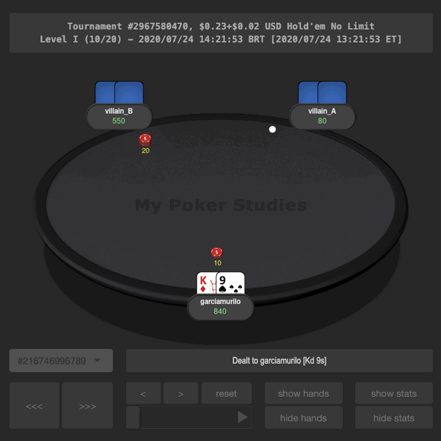

# HAND REPLAYER

Link: https://mypokerstudies.shinyapps.io/replayer/

Desenvolvi este ShinyApp em 2020 para revisar meus jogos de poker online. Você pode testá-lo entrando no link e fazendo o upload do arquivo de texto disponível no repositório. Por ora, o código não está público, mas podemos conversar sobre ele! Enquanto isso, deixo disponível outros códigos abertos de meus projetos relacionados a poker:

* https://github.com/murilogmamaral/odds (probabilidades de vencer)
* https://github.com/murilogmamaral/analysis (balanço de ganhos e perdas)
* https://github.com/murilogmamaral/datasetbuilding (estruturação de dados dos torneios)
* https://github.com/murilogmamaral/exploratory_data_analysis/tree/main/poker (análise de dados dos torneios)
